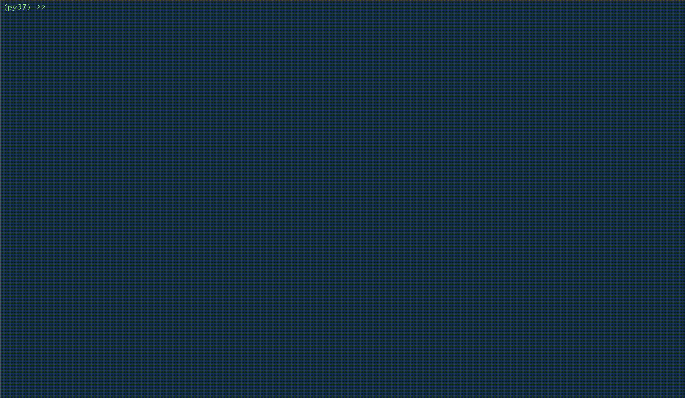

# Refugee Trends

This project builds on the work done by University of Oulu, University of Melbourne, and Harokopio University of Athens in their paper [Correlating Refugee Border Crossings with Internet Search Data](http://jultika.oulu.fi/files/nbnfi-fe201901222715.pdf). In that paper, they attempted to answer the question _Can Internet search data be used as a proxy to predict refugee  mobility?_. Per their findings, "Results indicate that the reuse of internet search data considerably improves the predictive power of the models." However, this research solely focused on refugees fleeing North Africa and the Middle East for Greece. This project aims to apply these techniques to refugees fleeing Somalia and South Sudan for Ethiopia.


## Refugee Correlation

First, add your Google Translate `.json` credentials path to `config.ini`.

`refugee_correlation.py` provides a tool that uses Google Translate and Google Trends to assist a user in identification of terms that may be correlated with refugee arrivals. This currently supports refugee arrivals to Ethiopia from Somalia and South Sudan. The user selects a country of interest (Somalia or South Sudan) then inputs a term. That term can optionally be translated into Somali or Sudanese. Then it is checked against Google Trends for that country. A Pearson correlation coefficient is returned for the Google Trend time series correlation with refugee arrivals to Ethiopia.




## Building Trends Data

Once you have identified a set of target terms using `refugee_correlation.py` you can use `build_trends.py` to generate a `.csv` file that maps Google Trends for those terms with [UNHCR refugee data for Ethiopia](https://data2.unhcr.org/en/country/eth). This can be run with:

```
python3 build_trends.py
```

You will be asked to enter terms (which should be entered pre-translated). Leave the input blank if you have no more terms to enter.